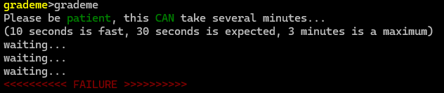

# 42ExamTrainer

The aim of this project is to help pre-students at 42 school pass their exams thanks to a console application that allows them to mark themselves on exercises presented during the exams.


## Installation

Make sure you're in a linux environment (virtual or real)

Make sure you have make installed

else, type:

```bash
  sudo apt install make
```
    
## Running
cloning the repo and going into it

type:

```bash
  make
  ./app
```
## Tutorial
In this page, choose the option you want


In this page, select the index of the exercise you want to be graded on


You are now in the grading page, before you trying to be graded, make sure your exercise is in the right directory.


If the exercise works, this message will be displayed:

else:
